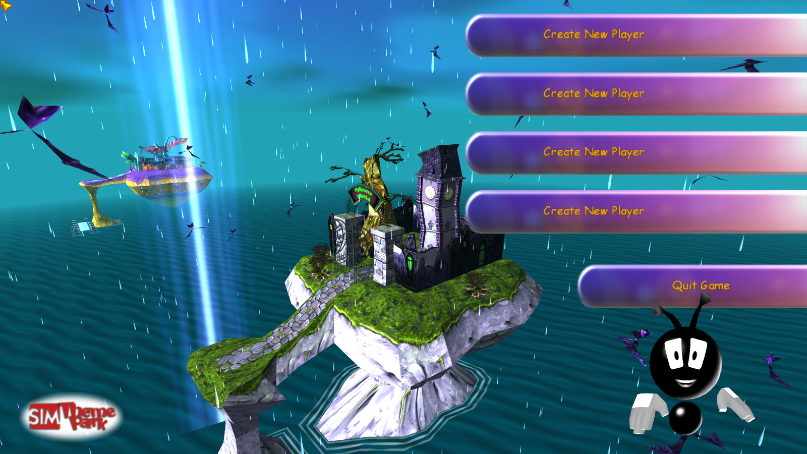

<p align="center">
    <h1 align="center">
        OpenTPW
    </h1>
    <p align="center">
        OpenTPW is an open-source re-implementation of <a href="https://en.wikipedia.org/wiki/Theme_Park_World">Sim Theme Park / Theme Park World</a>.
        <br>
        <a href="https://opentpw.gu3.me/formats/">Format documentation</a>
    </p>
</p>



## About

OpenTPW is a re-implementation of Theme Park World, requiring an installation of the original game and its assets in order to run. OpenTPW aims to re-create the same experience as the original game. While OpenTPW was initially created as it is quite difficult to get Sim Theme Park to run on modern hardware and on a modern operating system, it also aims to somewhat re-introduce the original online aspect of the game - the servers of which have since been shut down. Nothing of the online game is implemented yet; there is no networking code in the project at all.

**In order to run OpenTPW, you must have a full legal copy of any version of the original game.**

## Requirements

- The [.NET 8 SDK](https://dotnet.microsoft.com/download/dotnet/8.0). All five projects target `net8.0`.
- A GPU and driver that can run Vulkan on Linux and Windows, or Metal on macOS.
- On Linux, SDL2 from your distribution. The Veldrid.SDL2 package ships a native SDL2 for Windows and macOS only, so on Linux the window, input and audio are loaded from the system by soname - `libSDL2-2.0.so.0`, falling back to `libSDL2-2.0.so.1` and then `libSDL2-2.0.so`. Install your distribution's SDL2 2.x runtime and its Vulkan loader and driver.
- A copy of the original game, copied off the disc. The data folder is about 380MB.

You do **not** need to place a `libdl.so` symlink beside the build. glibc merged libdl into libc in 2.34 and the Vulkan bindings still ask for a bare `libdl`; OpenTPW redirects that itself as it starts.

## The game's files

Copy the disc somewhere you can write to - not Program Files - and put the OpenTPW build in with the game's files, where `TP.exe` was. That is how the original found its own data, as `.\data\2dmap\gsprite.tga`, relative to itself, and it is the arrangement OpenTPW is built around.

It will otherwise look, in this order: `--game <folder>` on the command line, `OPENTPW_GAME_PATH` in the environment, the `GamePath` setting if it has been changed from the value it ships with, the folder the build sits in and five above it, the working directory and five above it, and last the place the original installs itself on Windows.

```sh
OpenTPW --game "/path/to/Theme Park World"
OPENTPW_GAME_PATH="/path/to/Theme Park World" OpenTPW
```

Quote the path: the folder the game installs itself into has spaces in its name.

A folder counts as the game when it holds a `data` folder with the game's `levels` inside it. Case does not matter anywhere: the disc spells its top folder `Data` while an installed copy spells it `data`.

**Copy the disc with its long names.** A CD holds two directory trees, and the plain ISO 9660 one is in capitals and cut to 8.3 - `CHALLE~0.SAM` where the game asks for `Challenges.sam`. Nothing in the game opens in a copy taken from that tree, and no amount of case matching can repair it, because those are different names rather than different spellings. Mount the disc and copy from the mount, or use a tool that keeps the Joliet names. OpenTPW recognises a short-name copy and says so rather than failing later on.

Saves are written to `save/` beside the game's data, where the original keeps them, so a park saved by one is seen by the other.

## Building and running

```sh
dotnet build source/OpenTPW.sln
dotnet source/OpenTPW/bin/Debug/net8.0/OpenTPW.dll --game "/path/to/Theme Park World"
```

It does not matter what directory you start it from. The shaders and the one font OpenTPW draws its loading screen with are copied next to the binary by the build and found there.

Some keys, none of which the game tells you about: `Escape` opens the game menu, `F1` asks the advisor for help, `F2` hides the interface, `X` freezes the lobby camera, `[` and `]` move between islands, and `` ` `` toggles the ModKit editor.

`dotnet test` runs the unit tests. Six of them read real game files and are skipped when no installation can be found, so the suite is green on a machine that has never had the game; set `OPENTPW_GAME_PATH` to run them.

## Platforms

| Platform | Backend | Status |
|----------|---------|--------|
| Linux (x64) | Vulkan | Developed and run here |
| Windows (x64) | Vulkan | Same code path as Linux; not tested recently |
| macOS (Intel) | Metal | **Untested** - see below |
| macOS (Apple Silicon) | Metal, under Rosetta 2 | **Untested**, and needs an x86-64 build - see below |

Windows uses Vulkan rather than Direct3D 11 deliberately, so that a report from Windows lands on the same code Linux runs every day.

**macOS is written to be correct, not tested.** Nobody on the project has a Mac, so the Metal path has never been run. It is written against the same clip-space and depth conventions Vulkan is asked for, and the shader translation is left to Veldrid rather than hand-rolled, but bugs there will only be found by whoever reports them. Please do report them.

**Apple Silicon needs Rosetta 2.** Two of the native libraries OpenTPW depends on ship no arm64 build at all - `libveldrid-spirv.dylib` and `libsdl2.dylib` are both x86-64 only - so an arm64 build fails at startup, when the window is created, before it ever reaches the graphics device. Build and run for x86-64 instead, with an x64 .NET 8 runtime installed. This is a limitation of those upstream packages.

## Status

OpenTPW is not yet playable: you can walk around the front end but not enter a park.

**What works.** The lobby - four islands, their gates and flyers, the sky, the ocean, weather with thunder and lightning, and the park name signs. The original front end, drawn with the game's own interface meshes and `.bf4` fonts: player slots, the new player dialog, the quit box, the island panel with its golden key prices, and the help bar. The advisor, with lip sync, queued lines and interruption. The original particle system and its on-screen effects. The Escape game menu and the options screen, with volumes that apply as you move them, a display mode and a resolution that work, and a window you can resize at any aspect ratio. Machine options and players are saved to `save\Config.tcf` and `save\users`, as the original saves them.

**What does not.** Entering a park, rides and ride scripts, terrain from map data, video, and anything online.

### File formats

- ❌ - Not Implemented
- ⚠️ - Partially Implemented
- ✅ - Implemented

| Format                                                  | Status |
|---------------------------------------------------------|--------|
| Archives (.WAD, .SDT)                                   | ✅     |
| Textures ([.WCT](https://opentpw.gu3.me/formats/wct.html))                    | ✅     |
| Settings ([.SAM](https://opentpw.gu3.me/formats/sam.html))                    | ✅     |
| Sounds ([.SDT](https://opentpw.gu3.me/formats/sdt.html), .MP2) \*\*            | ✅     |
| Strings ([.BFMU](https://opentpw.gu3.me/formats/bfmu.html), [.BFST](https://opentpw.gu3.me/formats/bfst.html)) | ✅     |
| Fonts (.BF4)                                            | ✅     |
| Lip Sync ([.LIP](https://opentpw.gu3.me/formats/lips.html))                   | ✅     |
| Particles (.PLB, .ESP, .TPC)                            | ✅     |
| Machine and player saves (Config.tcf, gms.dat)          | ✅     |
| Models ([.MD2](https://opentpw.gu3.me/formats/m3d2.html)) \*                   | ⚠️     |
| Sound categories (cat_\*.map) \*\*                                             | ⚠️     |
| Park signs (.SGN) \*\*\*                                                        | ⚠️     |
| Park saves ([.TPWS](https://opentpw.gu3.me/formats/tpws-ints-lays.html)) \*\*\*\*      | ⚠️     |
| Map Data ([.MAP](https://opentpw.gu3.me/formats/map.html))                    | ❌     |
| Ride Scripts ([.RSE](https://opentpw.gu3.me/formats/rsse.html)) \*\*\*\*\*             | ❌     |
| Materials ([.MTR](https://opentpw.gu3.me/formats/mtr.html))                   | ❌     |
| Video ([.TQI](https://opentpw.gu3.me/formats/tqi.html))                       | ❌     |

\* **Models (.MD2)**: static mesh geometry (verts/faces/materials) loads reliably, along with the node tree that places the meshes and the ids a character's costume pieces are found by. The same extension is also used for a structurally distinct keyframe animation format, of which five channel kinds are decoded: per-vertex morph animation (768 files), per-node quaternion rotation (686 files), UV scrolling (324 files), position (455 files) and visibility (404 files), counted by the channels each file's tracks declare. 1183 of the game's 1279 animation files carry at least one of them; 6 carry only channel kinds that aren't decoded yet and 90 contain no animation data at all. The lobby plays morph, rotation and UV; so far only the advisor plays position and visibility.

\*\* **Sounds (.SDT, .MP2, cat_\*.map)**: banks are read, and their audio decodes and plays. Despite the .mp2 extension on every name inside a bank, the audio is not always MPEG Layer II - 2,646 of the game's 3,739 streams are Layer I - so both layers are decoded, and Layer III does not occur. Nothing in the game addresses a sound by file name: sounds are grouped into categories and code plays a numbered effect within one, which is what the cat_\*.map pair holds. Its bank half is fully decoded. Of its effect half, the header, the effect table and the sample records are decoded, but the variable-size header in front of each effect's sample list is not, so the records are located by validating them against the banks rather than by offset.

\*\*\* **Park signs (.SGN)**: a park's name board renders with the fonts, colours and artwork the file asks for. Two regions of its header - a 64x64 image at 0x03C5 and 36 bytes at 0x03A1 - are not identified.

\*\*\*\* **Park saves (.TPWS)**: the container is read - the header is parsed and its ZLIB payload inflated - but nothing inside the payload is decoded yet, and nothing in the game calls it. The saves that do work today are the machine's options and the players themselves, listed separately above.

\*\*\*\*\* **Ride Scripts (.RSE)**: there is no parser. What exists is the opcode scaffolding for the ride virtual machine, against a claimed total of 210 instructions.

## Troubleshooting

**"Theme Park World was not found."** OpenTPW lists every folder it looked in. Point it at the game with `--game <folder>` or `OPENTPW_GAME_PATH`, or put the build in with the game's files.

**"its names have been cut short."** The disc was copied from its plain ISO 9660 tree. Copy it again keeping the long names - see [The game's files](#the-games-files).

**It stops before a window appears, saying it could not load a native library.** On Linux, install your distribution's SDL2 2.x runtime, and the Vulkan loader and driver for your GPU.

**No sound.** Not fatal - OpenTPW warns and carries on. `OPENTPW_DEBUG_CONSOLE=1` reads commands from standard input if you want to drive a run reproducibly.

## Documentation

File format information is available at the [OpenTPW formats](https://opentpw.gu3.me/formats/) website, whose source is the [OpenTPW.FileFormats](https://github.com/OpenTPW/OpenTPW.FileFormats) repository. Keep in mind that this information is a work-in-progress, and therefore might not be of incredible detail - however, upon completion, it still aims to be as useful, detailed, and as in-depth as possible.

## Contributing

Contributions to this project are greatly appreciated; please follow these steps in order to submit your contribution to the project:

1. Fork the [Original Project](https://github.com/OpenTPW/OpenTPW)
2. Create a branch under the name `YourName/FeatureName`
3. Once you've made all the changes you need to make, go ahead and submit a Pull Request.

## License

This project is licensed under the MIT license; a copy of this license is available at [LICENSE.md](https://github.com/OpenTPW/OpenTPW/blob/main/LICENSE.md).
