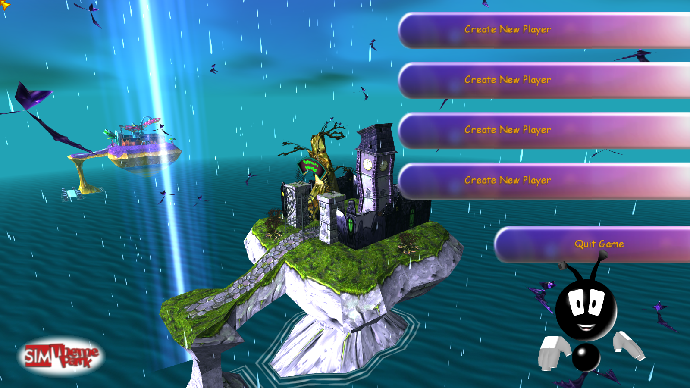

<p align="center">
    <h1 align="center">
        OpenTPW
    </h1>
    <p align="center">
        An open-source re-implementation of <a href="https://en.wikipedia.org/wiki/Theme_Park_World">Sim Theme Park / Theme Park World</a>.
    </p>
    <p align="center">
        <b>OpenTPW</b> · <a href="https://github.com/OpenTPW/OpenTPW.FileFormats">File Formats</a>
    </p>
</p>



## What this is

OpenTPW re-implements the engine of Theme Park World (1999) so it runs on modern computers. It reads the data files from your own copy of the game - models, textures, sounds, fonts and saves - and draws them with Vulkan.

**You need your own copy of the original game.** This repository ships no game content.

## Can I play it yet?

**Not yet.** OpenTPW is a work in progress. What works today:

- **The lobby works.** The four islands, the front end, the advisor, weather, the options screen and your saved players.
- **Only Lost Kingdom is partly working, and only from the park the game ships already built.** Enter it and the park runs: guests arrive, queue, ride and buy things; you can buy, sell and move rides, hire staff and lay paths.
- **A fresh, empty park does not work, on any of the four islands.**
- **There is no way to finish or keep a park.** No finances, no litter, and nothing saves a park back.

[`docs/STATUS.md`](docs/STATUS.md) lists everything that works and everything that does not.

To play the original game on Linux, [`tools/play-the-original`](tools/play-the-original/README.md) sets it up with
Proton. You need your own disc and your own no-CD `.exe`.

### Which version of the game?

OpenTPW is tested only with the **American release, Sim Theme Park**. Theme Park World, the release sold elsewhere, uses the same engine and data and **should** work, but is untested. If you try it, please report how it goes.

## Quick start

1. Install the [.NET 10 SDK](https://dotnet.microsoft.com/download/dotnet/10.0).
2. Copy your game disc to a folder - see [Getting the game's files](#getting-the-games-files).
3. Build and run:

```sh
dotnet build source/OpenTPW.sln
dotnet source/OpenTPW/bin/Debug/net10.0/OpenTPW.dll --game "/path/to/Sim Theme Park"
```

The build includes every library OpenTPW needs. You may also need a **Vulkan driver**. On Windows and macOS your graphics driver already provides it. On Linux, install your distribution's Vulkan loader (`libvulkan1`, `vulkan-loader` or `vulkan-icd-loader`, depending on the distribution) and Mesa or your GPU vendor's driver.

## Getting the game's files

1. Put the game disc in your computer. If you have a disc image (an `.iso` file), double-click it instead.
2. Open the disc in your file manager, the same way you open any folder.
3. Copy **everything** on it into a new folder, for example `Sim Theme Park` in your Documents.
4. Start OpenTPW and give it that folder, as in [Quick start](#quick-start). Put the folder's name in quotes.

If OpenTPW says the file names **"have been cut short"**, the copy went wrong. Delete the folder and copy the disc
again by dragging the files in your file manager.

If OpenTPW says it **cannot find the game**, check the folder you gave it. It lists every folder it looked in.

<details>
<summary>For technical users</summary>

**File names.** A CD holds two sets of file names. The short set is uppercase and cut to eight letters
(`CHALLE~0.SAM` instead of `Challenges.sam`), and the game cannot use it. Mount the disc and copy from the mount, or
use a tool that keeps the long (Joliet) names.

**Where OpenTPW looks.** A folder counts as the game when it has a `data` folder with `levels` inside it, in any
capitalisation. OpenTPW tries, in order: `--game` on the command line, `OPENTPW_GAME_PATH`, the `GamePath` setting
if you have changed it, the folder the build sits in, the working directory, and the default Windows install
location. It does not search parent folders.

**Saves** go to `save/` beside the game's data, where the original keeps them, so the original and OpenTPW share
options and players.

</details>

## Controls

| Key | Does |
|-----|------|
| `Escape` | Game menu - or, in a park, first let go of what you are holding, or leave the ground view |
| `Ctrl`+`H` | Show or hide the help bar |
| `F2` | Hide the interface |
| `X` | Freeze the lobby camera |
| `[` `]` | Move between islands |
| `C` | In a park: walk on the ground and look around, and back again |
| `←` `→` | Turn the park camera |
| Mouse wheel | Zoom the park camera |

## Platforms

| Platform | Builds | Runs |
|----------|--------|------|
| Linux x64 | ✅ | ✅ Developed and tested here |
| Linux arm64 | ✅ | ❔ Never run |
| Windows x64, arm64 | ✅ | ❔ Not run recently |
| macOS Intel, Apple Silicon | ✅ | ❔ Never run |

Every platform draws with Vulkan; on macOS through MoltenVK, which ships with the build. Only Linux x64 is tested. Bug reports from other platforms are very welcome.

<details>
<summary>Linux on Wayland</summary>

The SDL that ships with OpenTPW has no Wayland backend, so it runs through XWayland. Scaling and input then differ a little, and without XWayland it does not start. To use your distribution's SDL2 instead:

```sh
OPENTPW_SYSTEM_SDL=1 dotnet source/OpenTPW/bin/Debug/net10.0/OpenTPW.dll --game "/path/to/Sim Theme Park"
```

</details>

## Troubleshooting

**"Theme Park World was not found."** Check the folder you gave OpenTPW - see [Getting the game's files](#getting-the-games-files).

**"its names have been cut short."** The disc was copied without its long file names. Copy it again - see [Getting the game's files](#getting-the-games-files).

**It stops before a window appears, saying it could not load a native library.** Install your distribution's Vulkan loader and your GPU's driver.

**On Wayland the window scales oddly, or SDL says "No available video device".** Install XWayland, or see [Linux on Wayland](#platforms).

**No sound.** Not fatal - OpenTPW warns and carries on.

## For developers

```sh
dotnet build source/OpenTPW.sln
dotnet test source/OpenTPW.sln
```

Most tests read the real game files and skip when the game is not found; set `OPENTPW_GAME_PATH` to run them all.

<details>
<summary>Launch options and the debug console</summary>

**Launch options**

| Option | Does |
|--------|------|
| `--game <folder>` | Use the game in this folder. `--game=<folder>` also works. |
| `OPENTPW_GAME_PATH=<folder>` | The same, as an environment variable. |
| `OPENTPW_SYSTEM_SDL=1` | Use your system's SDL2 instead of the one in the build. |
| `OPENTPW_DEBUG_CONSOLE=1` | Turn on the debug console. |

**Opening the debug console.** Start OpenTPW from a terminal with `OPENTPW_DEBUG_CONSOLE=1` set, then type commands
into that terminal and press Enter. Every reply starts with `[dbg]`.

```sh
OPENTPW_DEBUG_CONSOLE=1 dotnet source/OpenTPW/bin/Debug/net10.0/OpenTPW.dll --game "/path/to/Sim Theme Park"
```

On Windows, run `set OPENTPW_DEBUG_CONSOLE=1` first, then start OpenTPW in the same window.

**Commands.** Most take numbers after the name, for example `island 2` or `step 10`. Many work only in a park.

| For | Commands |
|-----|----------|
| Going places | `lobby`, `island`, `enter`, `park`, `reload`, `quit` |
| Time | `pause`, `resume`, `step` |
| Lobby camera and weather | `orbit`, `freeze`, `unfreeze`, `attract`, `aim`, `settle`, `near`, `rain`, `weather`, `strike`, `bolt` |
| Park camera | `camera`, `camcorder`, `facing`, `walk` |
| Sound | `volume`, `mute`, `sound`, `voices`, `place`, `speech`, `advisor`, `greet`, `duck` |
| Reading the park | `guests`, `peeps`, `staff`, `candidates`, `rides`, `vehicles`, `paths`, `arrivals`, `objects`, `catalogue`, `money`, `rings`, `spend`, `why`, `cell`, `drawn`, `scriptvar`, `bumpers` |
| Changing guests | `arrive`, `admit`, `send`, `load`, `depart`, `happy`, `cash`, `thirst`, `balloon`, `toilet` |
| Building and staff | `buy`, `put`, `sell`, `move`, `path`, `delpath`, `queue`, `delqueue`, `hire`, `fire`, `pickup`, `putstaff`, `carry`, `drop`, `hand`, `strip`, `tool` |
| Mouse, keys and windows | `pick`, `click`, `rightclick`, `rmbcancel`, `worldclick`, `hover`, `pointer`, `backspace`, `menu`, `buyscreen`, `hirescreen`, `openthing`, `screen`, `windows`, `control`, `state` |
| Measuring | `stats`, `assets`, `parks`, `huds`, `water`, `size`, `unimplemented` |

Each command's arguments are in [`DebugConsole.cs`](source/OpenTPW/Client/Diagnostics/DebugConsole.cs), one `case`
per command. Add a new command to this table.

</details>

- [`docs/STATUS.md`](docs/STATUS.md) - what works and what does not.
- [`docs/QUEUE.md`](docs/QUEUE.md) - the work queue.
- [`docs/exe/`](docs/exe) - what the original executable does, decoded.
- [OpenTPW.FileFormats](https://github.com/OpenTPW/OpenTPW.FileFormats) - the game's file formats, documented.

<details>
<summary>File format support</summary>

❌ Not implemented &nbsp;&nbsp; ⚠️ Partially implemented &nbsp;&nbsp; ✅ Implemented

| Format | Status |
|--------|--------|
| Archives (.WAD, .SDT) | ✅ |
| Textures (.WCT) | ✅ |
| Settings (.SAM) | ✅ |
| Sounds (.SDT, .MP2) | ✅ |
| Strings (.BFMU, .BFST) | ⚠️ Read; a few long strings are cut short |
| Fonts (.BF4) | ✅ |
| Lip sync (.LIP) | ✅ |
| Particles (.PLB, .ESP, .TPC) | ✅ |
| Machine and player saves (Config.tcf, gms.dat) | ✅ |
| Map data (.MAP) | ✅ |
| Texture tables (.TCT) | ✅ |
| Models (.MD2) | ⚠️ Meshes load; some animation channel kinds are not decoded yet |
| Sound categories (cat_\*.map) | ⚠️ Decoded; a few fields are unnamed |
| Park signs (.SGN) | ⚠️ Read and drawn; a gradient fill is drawn flat |
| Park saves (.TPWS) | ⚠️ Read, only Lost Kingdom's shipped save tested; nothing writes one |
| Ride scripts (.RSE) | ⚠️ Every shipped script runs; some instructions are not built yet |
| Materials (.MTR) | ❌ |
| Video (.TQI) | ❌ |

</details>

## Contributing

Contributions are very welcome:

1. Fork the [original project](https://github.com/OpenTPW/OpenTPW).
2. Create a branch named `YourName/FeatureName`.
3. Open a pull request when you are ready.

## License

MIT - see [LICENSE.md](LICENSE.md).
